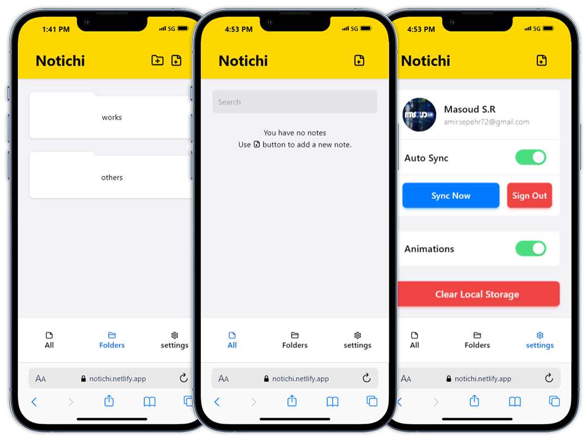

📒 Notichi: A Simple Notebook

A minimalist notebook app to keep your notes organized, accessible, and synced.

Features: 
- 📝 Save Notes Locally: Store your notes directly in your browser's local storage. 
- 📂 Organize with Folders: Keep notes sorted for easy access. 
- 🔍 Search Notes: Quickly find notes by searching keywords. 
- ☁️ Cloud Sync: Sync your notes across devices with cloud storage. 
- 📱 Progressive Web App (PWA): Use offline as a standalone app.

Technologies Used 
- Next.js 
- TypeScript 
- Tailwind CSS 
- API Routes 
- MongoDB

🌐 Try it out: [notichi.netlify.app](http://notichi.netlify.app)

